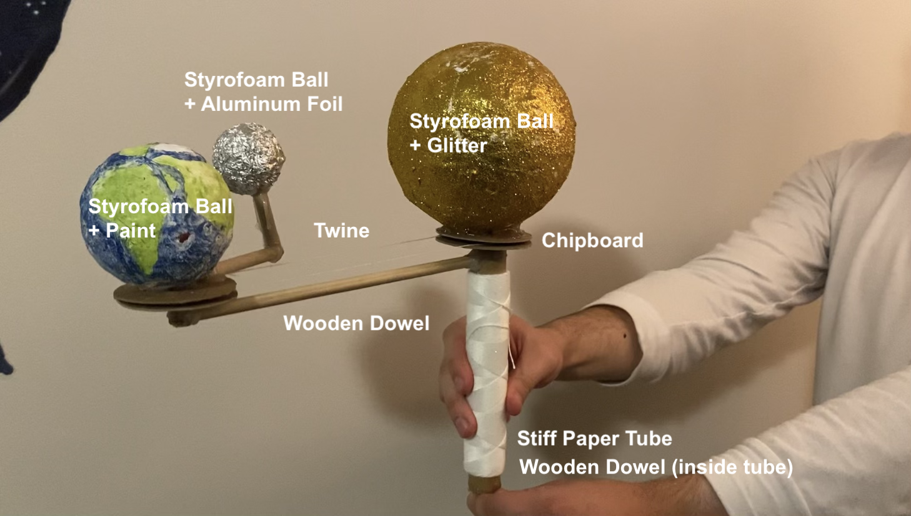
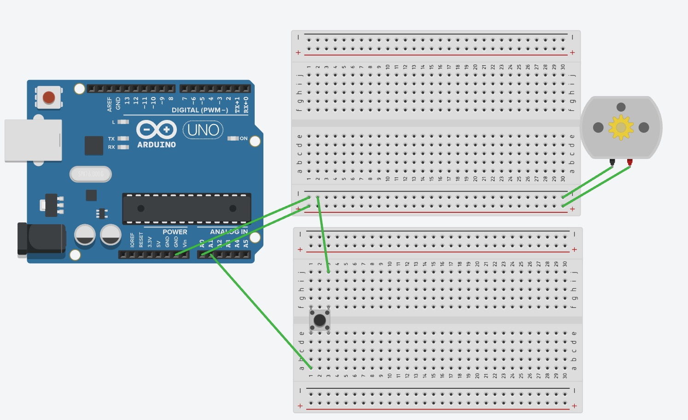
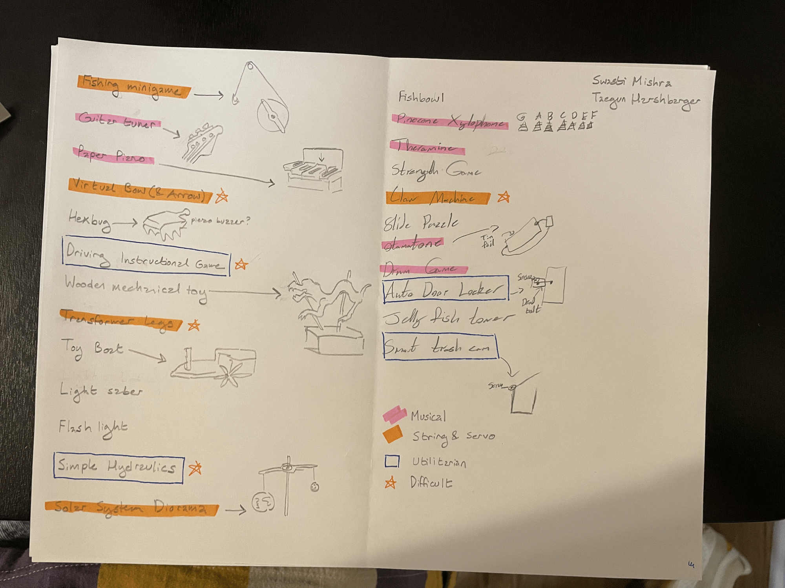
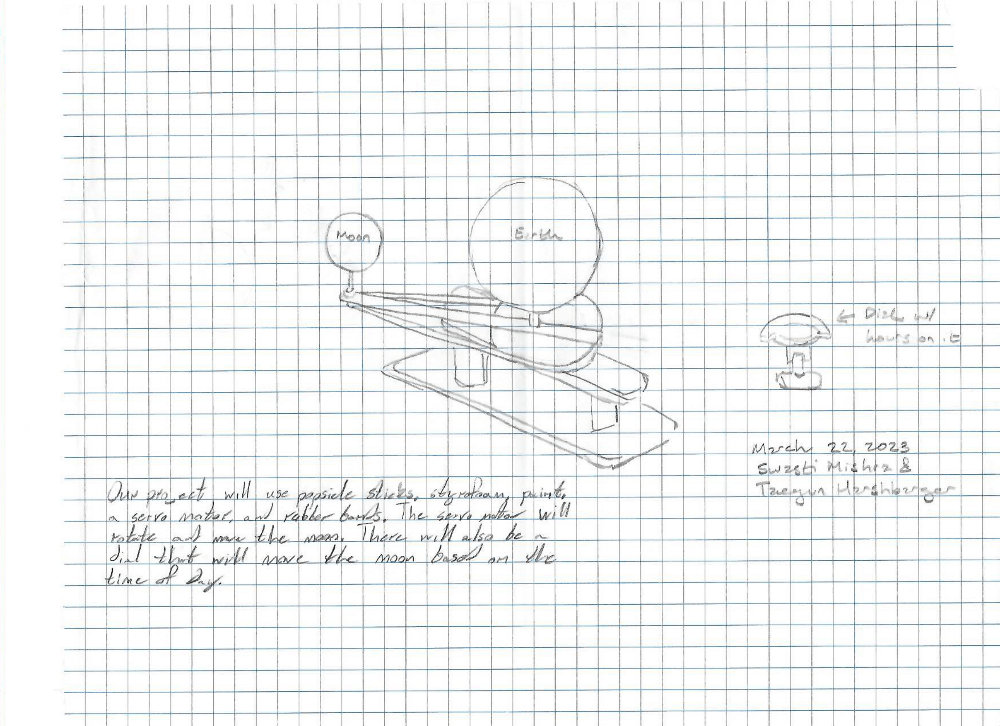

# mgP2: Simple Sun-Earth-Moon Model
*Interactive Input/Output with Low-Tech // Mar 30, 2023*   
Taegun Harshbarger (CoSci) and Swasti Mishra (CoSci)

https://github.com/pixelatinate/interactive-tech/tree/main/mgp2.md
<insert youtube link>  
  
## Overview
While we brainstormed a lot of ideas for this project, we finally settled on a Sun-Earth-Moon model because Taegun took an interesting Astrology class freshman year and was particularly drawn to the design. We were also excited to do more arts and crafts type of building for this project- as a result, we experimented a lot with pulleys, string, and hot glue, and slightly less with the circuitry. 

## Materials and Parts
The materials used to build this project are listed in the image and table below. Note: We listed more parts in the table than what are pictured below because we wanted to include all of the parts we *tried* to use to complete this project. 

| Part | Description of the Part's Role | Total Price | Count |  
| :--: | :--: | :--: | :--: |
| Large Chipboard | General building material | $4.99 | 1
| Dowel | Support for celestial bodies | $3.99 | 1
| Twine | Tension between pulleys | $6.99 | 1
| Hot Glue Gun & Sticks| Attached Pieces | $6.99 | 1
| Styrofoam Balls | Modeled Celestial Bodies | $10.39 | 3 
| Breadboarding Wire | Connected circuitry | $4.95 | 5
| Arduino Nano | Computer that connects to the hardware | $27.60 | 1
| Tactile Switch Buttons | Controls the motor | $2.50 | 1
| USB 2.0 Cable Type A/B | Enables upload of code from computer to arduino | $7.60 | 1
| DC Motor | Spins the model | $1.95 | 1
| 400 Point Solderless Breadboard | Enables project component connections | $7.49 | 2
|   | **Total** | **$85.44** | 

## Schematic

	
## Brainstorming
The first step of this project was brainstorming some potential project ideas. The following is a list of the projects we came up with. A few were inspired by the Nintendo Labo project (1), a few others were inspired by music, and another group was a mental exercise in what we could achieve with servo motors and string. As stated above, we finally built off the idea of a solar system diorama, but limited it to the sun, moon, and earth. 

## Sketches
The following is a sketch we did where we tried to figure out, conceptually, what needed to move and what needed to stay in place. 

## Intermediate Prototype
For our intermediate prototype, we drew what we thought would be the finalized sketch of our model, with descriptions of what the human-interactive elements would be. 

	
## Challenges
* **Servo Motor Not Spinning 360 Degrees** 
	* Kellan raised this point in critique, so we had to adjust our original sketches/initial prototypes to accept that our servo motor wouldn't be able to spin a full 360 degrees. 
	* One of the first things we tried to do to fix this issue was to adjust the servo motor itself so that it would rotate in a full circle. While we found a great youtube video as a guide, we couldn't find a screwdriver small enough to take the screw off the servo motor.(2)
	* We then tried to experiment with gear ratios. We weren't able to make those work either, so we ultimately decided that it would be simpler to limit our expectations of what the model could demonstrate. 
* **Trouble Finding Pulleys** 
	* At first, we wanted to buy two little pulleys for the diorama, because we thought that they would be more reliable. However, we went to both an art supply store and a hardware store, and couldn't find what we were looking for. 
	We finally decided to just make our own by stacking chipboard, which worked out for the better because it meant that our pulleys were lighter and therefore put less pressure on the motor. 
* **Trouble Understanding How Model Would Work:** 
	* There were so many moments over the course of this project where we struggled to figure out what would be spinning with the motor and what would be stationary. 
	* More in-depth diagrams could have helped a little, but ultimately we just needed to make models and play with stuff to get a better understanding of how the final model would look. 
* **Measuring Correctly:**
	* We should have been more careful about measuring and cutting the dowels and chipboard, because adjusting things took longer and wore down our willpower. 
* **Problems Attaching Diorama to Motor:** 
	* This problem was by far the most frustrating part of the project. We needed the dowel inside the sun to stay stationary while the tube on the outside moved, and while we eventually figured out how to do that via another pulley system, we encountered another problem. 
	* One other huge problem was that motor just wasn't strong enough for the amount of tension we were putting on it. We fixed this by swapping from the servo motor to the dc motor, but this had its own set of problems. 
	* Namely, that the DC motor required a very delicate balance of tension- not enough, like by using twine on the pulley attached to motor, and the string would just spin around the tube without pulling it. Too much, like with a rubber band wrapped around both pulleys, and the motor just wouldn't spin. 

## Future Work Ideas
We would love to actually connect a motor to the tube! This project was really frustrating, because we almost solved it- we were just limited by how strong the motors were. If we were to get a stronger motor, then this project would have worked out great. 
	
## Thoughts About the Project 
It was fun (for at least a little while!) to cut stuff out and glue things together, and also to papier mache the celestial planets and glitter the sun. If we had more time to do this project, we might have experimented with the size of the inner pulley discs, especially the one for the moon, so that the celestial objects orbited more realistically. 
	
## Links to Inspirations, Code Libraries, and Code Samples
See references! We didn't really use any other inspiration, code libraries, or code samples outside of what has already been cited. 
	
## References
1. [https://www.nintendo.com/ph/switch/adfu/index.html]()
2. [https://www.youtube.com/watch?v=JhHSXCLsN4k&feature=youtu.be]()
