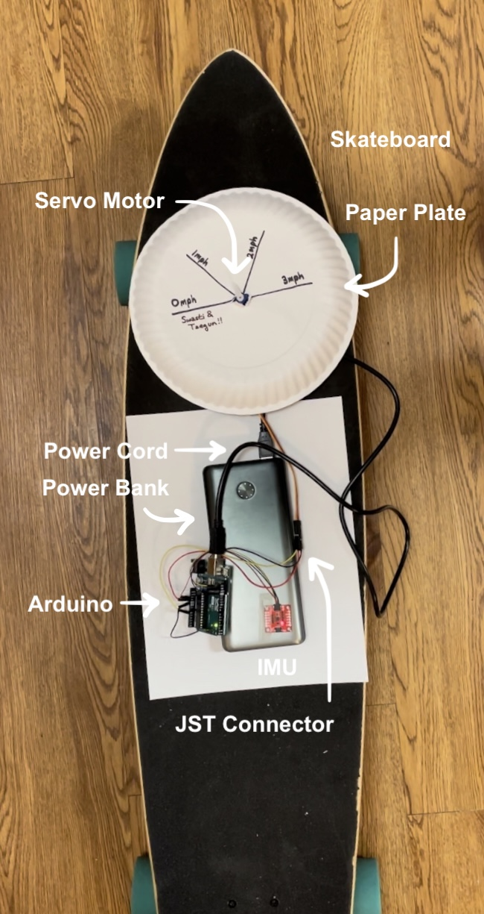
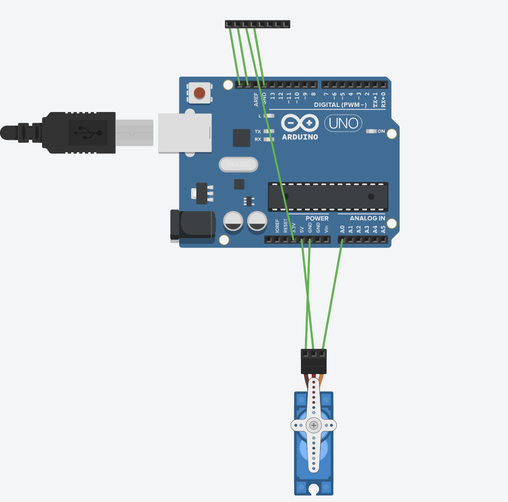
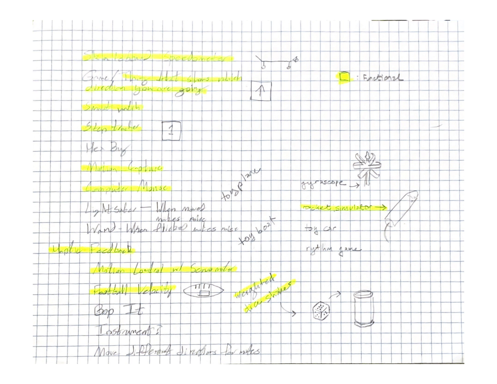
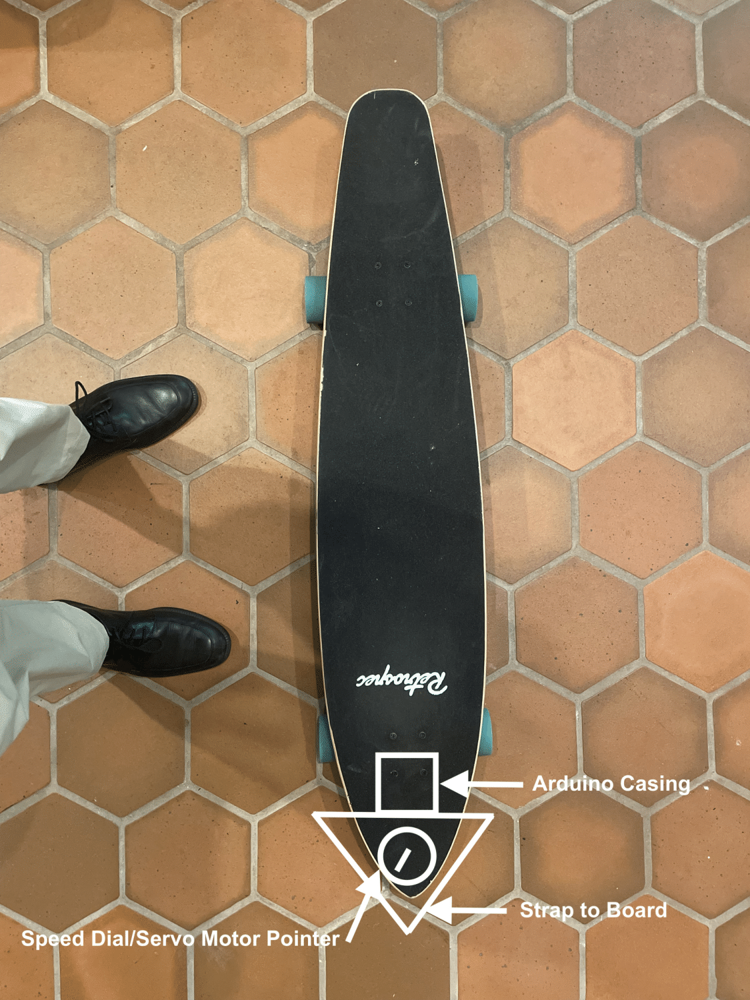

# mgP3: Skateboard Speedometer
*IMU, Motors and Such // Apr 12, 2023*
Taegun Harshbarger (CoSci) and Swasti Mishra (CoSci)

https://github.com/pixelatinate/interactive-tech/tree/main/mgp3.md
https://youtu.be/iVIEa5zapHI
 
Code can be found in this repository at MiniGroup3/MiniGroup3.ino

  
## Overview
We brainstormed quite a few ideas for this project, but we ultimately ended up going with our first idea, which was to build a skateboard speedometer. We decided to do this project because it seemed to be the most utilitarian- a friend of our's skateboards, and mentioned that he is occasionally curious about how quickly he is moving. Unfortunately, most app-based speedometers are based on GPS location, and because of the way skateboarding is, he doesn't cover a lot of ground in a straight line. We hoped our project would therefore be able to calculate his speed in a different way. 

## Materials and Parts
The materials used to build this project are listed in the image and table below. Note: The skateboard isn't included in the parts total because the expectation is that you already have one. 

| Part | Description of the Part's Role | Total Price | Count |  
| :--: | :--: | :--: | :--: |
| Paper Plate | General building material | $0.13 | 1
| Micro Servo Motor | Indicates speed | $5.95 | 1
| USB 2.0 Cable Type A/B | Enables upload of code from computer to arduino | $7.60 | 1
| JST Connector | Connects IMU to Arduino | $0.64 | 1
| ICM 20948 | Senses the device's movement through space | $18.50 | 1
| Power Bank | Makes the device portable | $21.99 | 1
| Arduino Uno Rev3 | Computer that connects to the hardware | $27.60 | 1
| 400 Point Solderless Breadboard | Enables project component connections | $7.49 | 2
|   | **Total** | **$89.90** | 

## Schematic
Note: The top bar is supposed to symbolize the IMU's connectors, but the software didn't have a built-in IMU piece.

	
## Brainstorming and Sketches
The first step of this project was brainstorming some potential project ideas. The following is a list of the projects we came up with. A major quality in whether or not we decided to further pursue a project this time was difficulty- this was top of our minds after the challenge of the last project.

## Intermediate Prototype
The following is a intermediate prototype we did where we tried to figure out what the speedometer would look like and where on the board it would sit.

	
## Challenges
* **Wiring the IMU** 
	* We had issues trying to wire and calibrate the IMU. It would only calibrate when you plugged and unplugged it at first, which meant that we were confused for a little while about why our error was so large.
* **Calculating Speed** 
	* Despite understanding the speed equation, it took us a little while to properly calculate the speed. This is because we were trying to calculate the speed from acceleration, and the IMU wouldn't properly calculate this property at first. To circumvent this, we started the program with a 10 second calibration period before calculating speed. 

## Future Work Ideas
If we had more time, it may be fun to 3D print a casing for the speedometer. If we could do that, the IMU would be less fragile, and the person riding the skateboard would have more board space to stand on. 
	
## Thoughts About the Project 
This project was super fun, and it was nice to make something with our friend in mind! In really shaped how we developed the project and thought about the requirements of the prototype. 
	
## Links to Inspirations, Code Libraries, and Code Samples
See references! We didn't really use any other inspiration, code libraries, or code samples outside of what has already been cited. 
	
## References
1. https://learn.adafruit.com/adafruit-tdk-invensense-icm-20948-9-dof-imu/arduino
